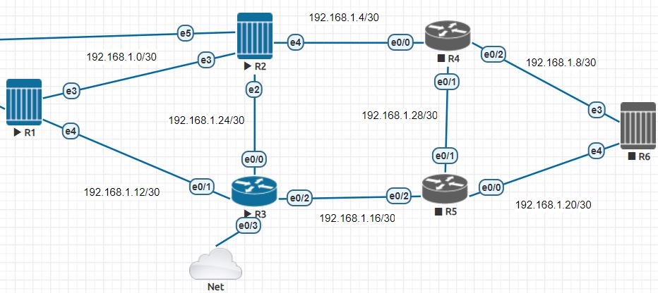
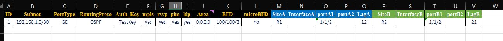
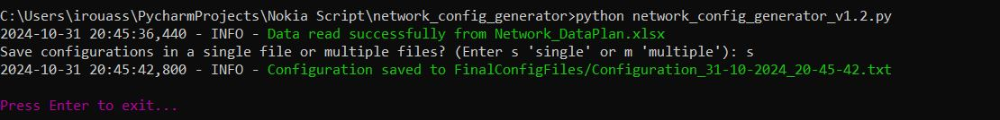
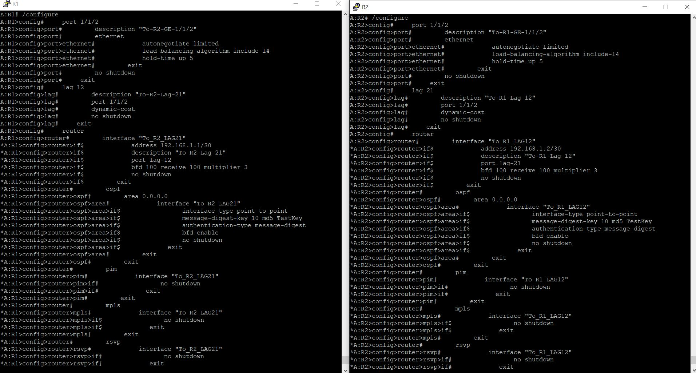
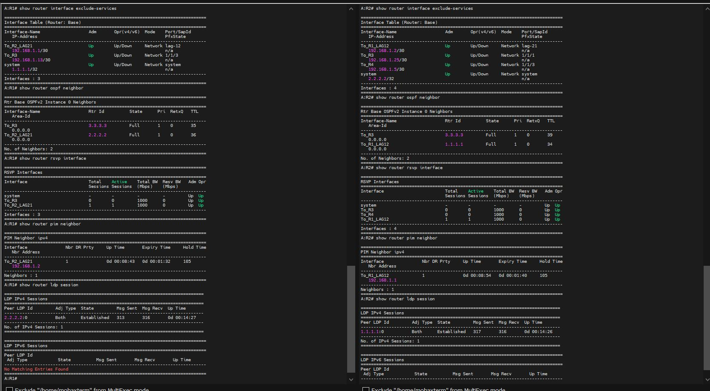

# Network Configuration Generator

This Python script automates the generation of 7750 SR Nokia network device configurations based on data from an Excel spreadsheet. It supports configuration generation for LAG (Link Aggregation Group) interfaces, OSPF/IS-IS routing protocols, and various network services like BFD, PIM, MPLS, RSVP, and LDP.

## Installation

1. Clone or download this repository.
2. Install the required packages using pip `Python 3.x`:

    ```bash
    pip install pandas openpyxl ipaddress colorama 
    ```

## Usage

1. Prepare your Excel file (`Network_DataPlan.xlsx`) with the required configuration data
2. Run the script:

   ```bash
   python network_config_generator_v1.2.py
   ```
4. Generated configurations will be saved in the `FinalConfigFiles` directory


## Input Data Format
The script expects the following columns in the input Excel file:
- **portA{n}:** Ports on Site A (where `n` is the port number  
- **portA{n}:** Ports on Site B (where `n` is the port number  
- **SiteA:** Name of the first site.
- **SiteB:** Name of the second site.
- **LagA:** Logical aggregation group for Site A.
- **LagB:** Logical aggregation group for Site B.
- **Subnet:** Subnet in CIDR notation (e.g., `192.168.1.0/30`).
- **PortType:** Type of port (e.g., `GE`, `10GE`, `100GE`).
- **RoutingProto:** Routing protocol to use (`ospf` Or `isis`.).
- **Area:** Area for OSPF (only required if RoutingProto is `ospf`).
- **InterfaceA:** Interface for Site A (If no value, the interface will be created automatically).
- **InterfaceB:** Interface for Site B (If no value, the interface will be created automatically).
- **microBFD:** Whether to enable micro BFD (`yes` or `no`).
- **BFD:** BFD parameters (e.g., `Tx/Rx/multiplier` Or `empty`).
- **pim:** Enable PIM (`yes` or `no`).
- **mpls:** Enable MPLS (`yes` or `no`).
- **rsvp:** Enable RSVP (`yes` or `no`).
- **ldp:** Enable LDP (`yes` or `no`).
- **Auth_Key:** Authentication key for routing protocols.

## Configuration Options

The generated configuration will include:
- **Port Configurations:**  Specific configurations for each port based on the data provided .
- **Interface Configurations:** Settings for interfaces on the routers, including addresses and descriptions.
- **Routing Protocol Configurations:** Options for OSPF or ISIS, depending on the routing protocol specified in the input.
- **BFD Configuration:** Configurations for Bidirectional Forwarding Detection if enabled.
- **Additional Protocol Configurations:** Optional configurations for protocols like PIM, MPLS, RSVP, and LDP, depending on the input flags.
- **Extensibility:** You can add more specific parameters for each configuration section in the script if needed (e.g., `lldp`, `QOS`, `policy`, etc.).

## Output

The script generates a configuration file with the following naming format:
```
Configuration_DD-MM-YYYY_HH-MM-SS.txt
```
## Sample Result










## Directory Structure

```
.
├── network_config_generator_v1.2.py
├── Network_DataPlan.xlsx
└── FinalConfigFiles/
    └── Config_file_<timestamp>.txt
```

## Acknowledgments
- **pandas** for data manipulation and analysis.
- **openpyxl** for reading Excel files.
- **ipaddress** for handling IP addresses.

## License
This project is licensed under the MIT License - see the [LICENSE](LICENSE) file for details.

